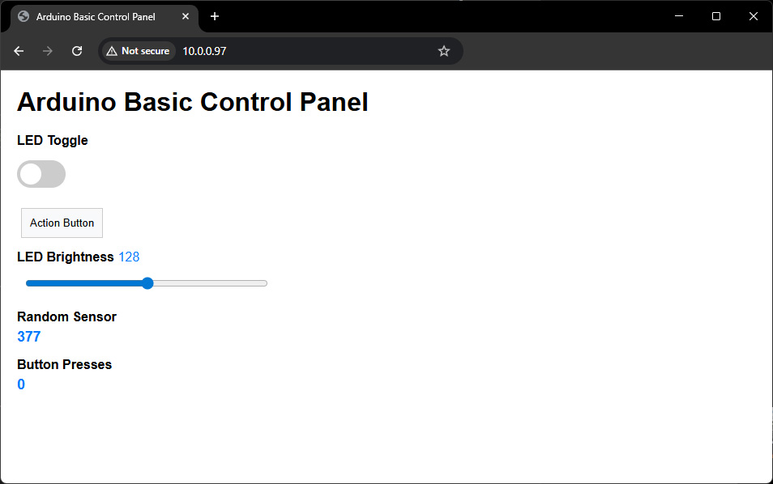
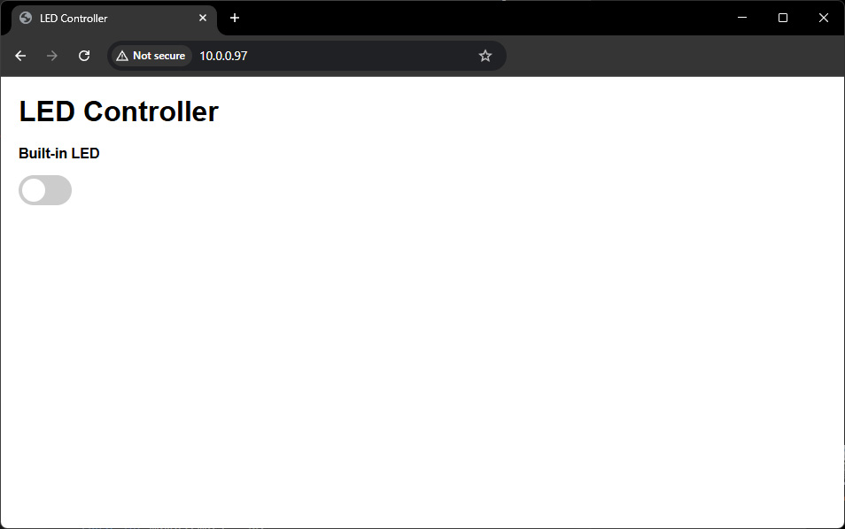
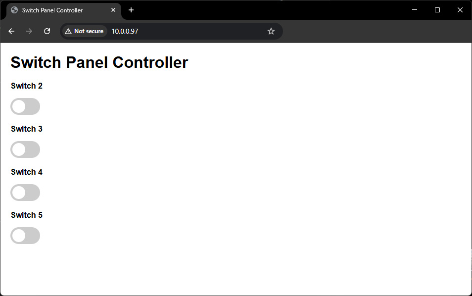
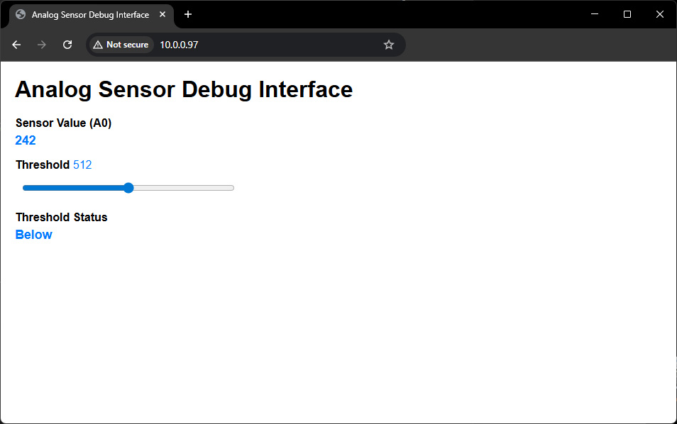
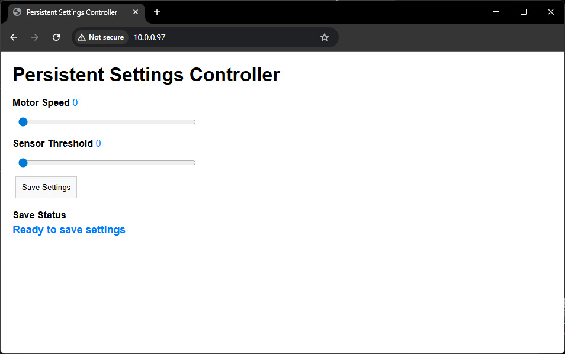
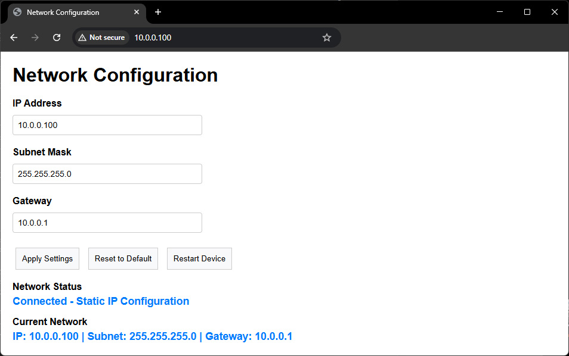

# WebGUI Library for Arduino

[](https://www.arduino.cc/)
[](https://www.espressif.com/en/products/socs/esp32)
[](https://www.gnu.org/licenses/lgpl-2.1)

A simple and powerful web-based GUI library for Arduino that enables you to create beautiful control interfaces accessible through any web browser. Perfect for IoT projects, home automation, and remote device control.

## Table of Contents

- [Features](#features)
- [Compatible Hardware](#compatible-hardware)
- [Installation](#installation)
- [Quick Start](#quick-start)
- [API Reference](#api-reference)
  - [WebGUI Class](#webgui-class)
  - [Button Class](#button-class)
  - [Toggle Class](#toggle-class)
  - [Slider Class](#slider-class)
  - [SensorStatus Class](#sensorstatus-class)
  - [TextBox Class](#textbox-class)
  - [Memory Monitoring & Utility Functions](#memory-monitoring--utility-functions)
- [Example Projects](#example-projects)
  - [AP vs Station Mode](#ap-vs-station-mode)
  - [Examples](#examples)
- [Network Configuration](#network-configuration)
  - [Advanced Network Features](#advanced-network-features)
    - [Auto-Discovery](#auto-discovery)
    - [Static IP Configuration](#static-ip-configuration)
    - [Network Configuration Interface](#network-configuration-interface)
- [License](#license)

## Features

- **Web-Based Interface**: Access your Arduino through any web browser - no app installation required
- **Mobile-Friendly**: Responsive design works on phones, tablets, and computers  
- **Interactive Controls**: Buttons, toggles, sliders, and status displays with real-time updates
- **Memory Optimized**: Streaming HTML generation prevents crashes on memory-constrained devices
- **Debounced Input**: Smart client-side debouncing prevents network flooding
- **Status Monitoring**: Read-only displays for sensor data and system status
- **Dual WiFi Modes**: Access Point mode for standalone operation or Station mode for existing networks


## Compatible Hardware

- **Arduino UNO R4 WiFi** *Fully tested and optimized*
- **Arduino Nano 33 IoT** *Fully tested and optimized*
- **ESP32** (all variants) *Excellent performance*

### Memory Requirements
- **Minimum RAM**: 8KB recommended (library uses optimized streaming)
- **Flash**: ~65KB for full feature set including examples
- **Performance**: Handles 8+ GUI elements on Arduino UNO R4 WiFi

## Installation

### Arduino IDE Library Manager (Recommended)
1. Open Arduino IDE
2. Go to **Sketch** → **Include Library** → **Manage Libraries**
3. Search for "WebGUI"
4. Click **Install**

### Manual Installation
1. Download the latest release from [GitHub](https://github.com/npuckett/WebGUI)
2. Extract the ZIP file
3. Copy the `WebGUI` folder to your Arduino `libraries` directory
4. Restart Arduino IDE

## Quick Start

```cpp
#include <WebGUI.h>

// *** WIFI CREDENTIALS - UPDATE THESE ***
const char* WIFI_SSID = "YourWiFiName";       // Replace with your WiFi network name
const char* WIFI_PASSWORD = "YourWiFiPassword"; // Replace with your WiFi password

// Create a simple LED toggle control
Toggle ledToggle("Built-in LED", 20, 50, 120);

void setup() {
  Serial.begin(115200);
  
  // Configure built-in LED
  pinMode(LED_BUILTIN, OUTPUT);
  digitalWrite(LED_BUILTIN, LOW);
  
  // Try to connect to existing WiFi network
  Serial.println("Attempting to connect to WiFi...");
  if (GUI.connectWiFi(WIFI_SSID, WIFI_PASSWORD)) {
    Serial.println("Connected to WiFi network: " + String(WIFI_SSID));
    Serial.println("Web interface: http://" + GUI.getIP());
  } else {
    // Fallback to Access Point mode if WiFi connection fails
    Serial.println("WiFi connection failed - starting backup Access Point");
    GUI.startAP("LED-Controller", "password123");
    Serial.println("Connect to WiFi: LED-Controller");
    Serial.println("Web interface: http://192.168.4.1");
  }
  
  // Configure interface
  GUI.setTitle("LED Controller");
  
  // Add toggle to GUI
  GUI.addElement(&ledToggle);
  
  // Start web server
  GUI.begin();
  
  Serial.println("LED Controller ready!");
}

void loop() {
  GUI.update();  // Always call this in loop()
  
  // Check if toggle was switched
  if (ledToggle.wasToggled()) {
    bool isOn = ledToggle.isOn();
    digitalWrite(LED_BUILTIN, isOn);
    Serial.println("Built-in LED: " + String(isOn ? "ON" : "OFF"));
  }
}
```

## API Reference

### WebGUI Class

The main class that manages the web interface, WiFi connection, and all GUI elements.

#### Setup Methods

**startAP(ssid, password)** - Create WiFi Access Point
```cpp
void setup() {
  // Create a standalone WiFi network
  GUI.startAP("MyDevice", "mypassword");
  // Device will be accessible at 192.168.4.1
}
```

**connectWiFi(ssid, password)** - Connect to existing WiFi (returns bool)
```cpp
void setup() {
  // Connect to your home/office WiFi
  if (GUI.connectWiFi("HomeWiFi", "wifipass")) {
    Serial.println("Connected! IP: " + GUI.getIP());
  } else {
    Serial.println("Connection failed - falling back to AP mode");
    GUI.startAP("Backup-Network", "password123");
  }
}
```

**Static IP Configuration** - Set fixed IP address in Station mode
```cpp
void setup() {
  // Configure static IP before connecting (optional)
  IPAddress staticIP(192, 168, 1, 100);    // Desired static IP
  IPAddress gateway(192, 168, 1, 1);       // Router IP
  IPAddress subnet(255, 255, 255, 0);      // Subnet mask
  IPAddress dns(8, 8, 8, 8);               // DNS server
  
  WiFi.config(staticIP, gateway, subnet, dns);
  
  // Connect with static IP configuration
  GUI.connectWiFi("HomeWiFi", "wifipass");
  Serial.println("Static IP: " + GUI.getIP());
  // Will print: "Static IP: 192.168.1.100"
}
```

**connectWiFiWithStaticIP(ssid, password, ip, subnet, gateway)** - Advanced static IP configuration
```cpp
void setup() {
  // One-step static IP connection with auto-discovery
  bool connected = GUI.connectWiFiWithStaticIP(
    "HomeWiFi", "wifipass",
    "192.168.1.100",    // Static IP
    "255.255.255.0",    // Subnet mask  
    "192.168.1.1"       // Gateway
  );
  
  if (connected) {
    Serial.println("Connected with static IP: " + GUI.getIP());
  } else {
    Serial.println("Static IP connection failed");
    GUI.startAP("Backup-Network", "password123");
  }
}
```

**begin()** - Start web server
```cpp
void setup() {
  // Always call after adding all elements
  GUI.addElement(&myButton);
  GUI.addElement(&mySlider);
  GUI.begin();  // Start the web server
}
```

**update()** - Process web requests (call in loop)
```cpp
void loop() {
  GUI.update();  // REQUIRED: Call every loop iteration
  
  // Your code here...
}
```

#### Configuration Methods

**setTitle(title)** - Set browser tab title and page heading
```cpp
void setup() {
  GUI.setTitle("Smart Home Controller");
  // Browser tab will show "Smart Home Controller"
  // Page heading will also be "Smart Home Controller"
}
```

**setCustomCSS(css)** - Add custom styling
```cpp
void setup() {
  GUI.setCustomCSS(
    "body { background: linear-gradient(135deg, #667eea, #764ba2); }"
    ".webgui-button { border-radius: 20px; }"
  );
}
```

**addElement(element)** - Add control to interface
```cpp
Button myBtn("Test", 20, 50);
Slider mySlider("Speed", 20, 100, 0, 100, 50);

void setup() {
  GUI.addElement(&myBtn);     // Add button
  GUI.addElement(&mySlider);  // Add slider
}
```

**getIP()** - Get device IP address
```cpp
void setup() {
  GUI.begin();
  Serial.println("Access at: http://" + GUI.getIP());
}
```

**restartDevice()** - Cross-platform device restart
```cpp
Button restartBtn("Restart", 20, 50);

void loop() {
  GUI.update();
  
  if (restartBtn.wasPressed()) {
    Serial.println("Restarting device...");
    delay(1000);  // Allow time for response
    GUI.restartDevice();  // Cross-platform restart
  }
}
```

#### Persistent Settings Management

The WebGUI library includes a simplified persistent settings API that automatically handles cross-platform storage (EEPROM for Arduino boards, Preferences for ESP32). Values are preserved across power cycles and device resets.

**initSettings()** - Initialize persistent storage system
```cpp
void setup() {
  GUI.initSettings();  // Call once before using save/load methods
}
```

**saveSetting(key, value)** - Save values to persistent storage
```cpp
// Save different data types
GUI.saveSetting("motorSpeed", 75);           // int
GUI.saveSetting("temperature", 23.5);        // float  
GUI.saveSetting("enabled", true);            // bool
GUI.saveSetting("deviceName", "Controller"); // string

// Example: Save slider values
if (saveButton.wasPressed()) {
  GUI.saveSetting("setting1", slider1.getIntValue());
  GUI.saveSetting("setting2", slider2.getIntValue());
}
```

**loadIntSetting(key)**, **loadFloatSetting(key)**, **loadBoolSetting(key)**, **loadStringSetting(key)** - Load values from persistent storage
```cpp
void setup() {
  GUI.initSettings();
  
  // Load saved values (returns 0/""/false if key not found)
  int motorSpeed = GUI.loadIntSetting("motorSpeed");
  float temp = GUI.loadFloatSetting("temperature");
  bool isEnabled = GUI.loadBoolSetting("enabled");
  String name = GUI.loadStringSetting("deviceName");
  
  // Restore slider values
  slider1.setValue(GUI.loadIntSetting("setting1"));
  slider2.setValue(GUI.loadIntSetting("setting2"));
}
```

**Complete Persistent Settings Example**
```cpp
#include <WebGUI.h>

Slider speedSlider("Motor Speed", 20, 50, 0, 100, 50);
Button saveButton("Save Settings", 20, 120, 120, 40);
SensorStatus saveStatus("Status", 20, 170, 200);

void setup() {
  GUI.initSettings();
  
  // Load and restore saved value
  int savedSpeed = GUI.loadIntSetting("motorSpeed");
  speedSlider.setValue(savedSpeed);
  
  GUI.addElement(&speedSlider);
  GUI.addElement(&saveButton);
  GUI.addElement(&saveStatus);
  GUI.begin();
  
  saveStatus.setValue("Ready to save");
}

void loop() {
  GUI.update();
  
  if (saveButton.wasPressed()) {
    GUI.saveSetting("motorSpeed", speedSlider.getIntValue());
    saveStatus.setValue("Settings saved!");
  }
}
```

### Button Class

Interactive button control for triggering actions.

#### Constructor
```cpp
Button(label, x, y, width=100, height=40);
```

**Example:**
```cpp
Button powerBtn("Power", 20, 50, 120, 45);    // Custom size
Button resetBtn("Reset", 160, 50);            // Default size
```

#### Methods

**wasPressed()** - Check if button was clicked
```cpp
Button actionBtn("Action", 20, 50);

void loop() {
  GUI.update();
  
  if (actionBtn.wasPressed()) {
    Serial.println("Action button clicked!");
    // Trigger one-time action
    digitalWrite(LED_BUILTIN, !digitalRead(LED_BUILTIN));
  }
}
```

**isPressed()** - Check current press state
```cpp
Button holdBtn("Hold", 20, 50);

void loop() {
  GUI.update();
  
  if (holdBtn.isPressed()) {
    // Continuous action while held
    analogWrite(6, 255);  // LED at full brightness
  } else {
    analogWrite(6, 0);    // LED off
  }
}
```

**setButtonStyle(style)** - Set button appearance
```cpp
Button primaryBtn("Save", 20, 50);
Button dangerBtn("Delete", 140, 50);

void setup() {
  primaryBtn.setButtonStyle("primary");  // Blue button
  dangerBtn.setButtonStyle("danger");    // Red button
  // Options: "primary", "secondary", "success", "danger", "warning"
}
```

### Toggle Class

Switch-like control for on/off states with visual feedback.

#### Constructor
```cpp
Toggle(label, x, y, width=80);
```

**Example:**
```cpp
Toggle ledToggle("Room Light", 20, 50, 100);   // Custom width
Toggle fanToggle("Ceiling Fan", 20, 120);      // Default width
```

#### Methods

**wasToggled()** - Check if toggle state changed
```cpp
Toggle lightToggle("Light", 20, 50);

void loop() {
  GUI.update();
  
  if (lightToggle.wasToggled()) {
    bool isOn = lightToggle.isOn();
    digitalWrite(2, isOn);  // Control LED on pin 2
    Serial.println("Light: " + String(isOn ? "ON" : "OFF"));
  }
}
```

**isOn()** - Get current toggle state
```cpp
Toggle pumpToggle("Water Pump", 20, 50);

void loop() {
  GUI.update();
  
  // Continuous state checking
  if (pumpToggle.isOn()) {
    digitalWrite(PUMP_PIN, HIGH);
  } else {
    digitalWrite(PUMP_PIN, LOW);
  }
}
```

**setToggleState(state)** - Programmatically set state
```cpp
Toggle autoToggle("Auto Mode", 20, 50);

void setup() {
  autoToggle.setToggleState(true);  // Start in ON position
}

void loop() {
  // Can change state based on conditions
  if (sensorValue > 100) {
    autoToggle.setToggleState(false);  // Force OFF
  }
}
```

### Slider Class

Continuous value control with customizable range.

#### Constructor
```cpp
Slider(label, x, y, minValue, maxValue, defaultValue, width=300);
```

**Example:**
```cpp
Slider brightness("Brightness", 20, 50, 0, 255, 128);      // 8-bit range
Slider temperature("Target °C", 20, 120, 15, 30, 22);      // Temperature range
Slider volume("Volume %", 20, 190, 0, 100, 50, 250);       // Custom width
```

#### Methods

**getIntValue()** - Get current value as integer
```cpp
Slider speedSlider("Motor Speed", 20, 50, 0, 255, 100);

void loop() {
  GUI.update();
  
  int speed = speedSlider.getIntValue();
  analogWrite(MOTOR_PIN, speed);  // PWM control
  
  Serial.println("Speed: " + String(speed));
}
```

**getFloatValue()** - Get current value as float
```cpp
Slider voltageSlider("Voltage", 20, 50, 0, 5, 3.3);

void loop() {
  GUI.update();
  
  float voltage = voltageSlider.getFloatValue();
  // Use for precise analog control
  dacWrite(DAC_PIN, (int)(voltage * 51.2));  // ESP32 DAC
}
```

**setValue(value)** - Set slider value programmatically
```cpp
Slider targetSlider("Target", 20, 50, 0, 100, 50);

void loop() {
  GUI.update();
  
  // Auto-adjust based on sensor
  int sensorReading = analogRead(A0);
  int targetValue = map(sensorReading, 0, 1023, 0, 100);
  targetSlider.setValue(targetValue);
}
```

**setRange(min, max)** - Change min/max values
```cpp
Slider configSlider("Value", 20, 50, 0, 100, 50);

void setup() {
  // Can change range based on mode
  if (advancedMode) {
    configSlider.setRange(0, 1000);  // Extended range
  } else {
    configSlider.setRange(0, 10);    // Simple range
  }
}
```

### SensorStatus Class

Read-only display for sensor data and system status.

#### Constructor
```cpp
SensorStatus(label);
```

**Example:**
```cpp
SensorStatus temperature("Temperature");
SensorStatus humidity("Humidity"); 
SensorStatus uptime("System Uptime");
SensorStatus memoryFree("Free RAM");
```

#### Methods

**setValue(int value)** - Set integer value
```cpp
SensorStatus counter("Button Presses");
int pressCount = 0;

void loop() {
  GUI.update();
  
  if (myButton.wasPressed()) {
    pressCount++;
    counter.setValue(pressCount);  // Shows: "Button Presses: 5"
  }
}
```

**setValue(float value)** - Set float value with precision
```cpp
SensorStatus voltage("Battery Voltage");

void loop() {
  GUI.update();
  
  float volts = analogRead(A0) * (5.0 / 1023.0);
  voltage.setValue(volts);  // Shows: "Battery Voltage: 3.42"
}
```

**setValue(bool value)** - Set boolean value (true/false)
```cpp
SensorStatus doorStatus("Door");
SensorStatus alarmStatus("Alarm Active");

void loop() {
  GUI.update();
  
  bool doorOpen = digitalRead(DOOR_SENSOR_PIN);
  doorStatus.setValue(doorOpen);     // Shows: "Door: true" or "Door: false"
  
  alarmStatus.setValue(!doorOpen);   // Shows: "Alarm Active: true" when door closed
}
```

**setValue(String value)** - Set string value with units
```cpp
SensorStatus temperature("Temperature");
SensorStatus status("System Status");
SensorStatus location("GPS");

void loop() {
  GUI.update();
  
  // With units
  temperature.setValue("23.5°C");
  
  // Status messages
  if (WiFi.status() == WL_CONNECTED) {
    status.setValue("Connected");
  } else {
    status.setValue("Disconnected");
  }
  
  // Complex data
  location.setValue("40.7128°N, 74.0060°W");
}
```

### TextBox Class

Text input controls for user data entry with validation and specialized IP address support.

#### Constructor
```cpp
TextBox(label, x, y, width, defaultValue);
```

**Example:**
```cpp
TextBox deviceName("Device Name", 20, 50, 200, "Arduino-01");
TextBox ipAddress("IP Address", 20, 100, 300, "192.168.1.100");
TextBox portNumber("Port", 20, 150, 100, "8080");
```

#### Methods

**getValue()** - Get current text value
```cpp
TextBox serverURL("Server URL", 20, 50, 300, "http://api.example.com");

void loop() {
  GUI.update();
  
  if (connectButton.wasPressed()) {
    String url = serverURL.getValue();
    Serial.println("Connecting to: " + url);
    // Use the URL for your connection logic
  }
}
```

**setValue(String value)** - Set text value programmatically
```cpp
TextBox deviceID("Device ID", 20, 50, 200);

void setup() {
  // Set device ID based on MAC address
  String macAddress = WiFi.macAddress();
  deviceID.setValue("ESP32-" + macAddress.substring(12));
}
```

**wasChanged()** - Check if value was modified by user
```cpp
TextBox configText("Configuration", 20, 50, 300, "default");

void loop() {
  GUI.update();
  
  if (configText.wasChanged()) {
    String newValue = configText.getValue();
    Serial.println("Configuration changed to: " + newValue);
    // Save or validate the new configuration
  }
}
```

#### IP Address Methods

**setIPAddress(String ip)** - Set IP address with validation
```cpp
TextBox ipBox("IP Address", 20, 50, 300);

void setup() {
  ipBox.setIPAddress("192.168.1.100");  // Sets and validates IP format
}
```

**getIPAddress()** - Get IP address with format validation
```cpp
TextBox ipBox("IP Address", 20, 50, 300, "192.168.1.100");

void loop() {
  GUI.update();
  
  if (applyButton.wasPressed()) {
    String ip = ipBox.getIPAddress();
    if (ip.length() > 0) {
      Serial.println("Valid IP: " + ip);
      // Apply the IP configuration
    } else {
      Serial.println("Invalid IP address format");
    }
  }
}
```

#### Network Validation

**validateNetworkConfig(ip, subnet, gateway)** - Static method for network validation
```cpp
void loop() {
  GUI.update();
  
  if (applyButton.wasPressed()) {
    String ip = ipBox.getIPAddress();
    String subnet = subnetBox.getValue();
    String gateway = gatewayBox.getIPAddress();
    
    if (TextBox::validateNetworkConfig(ip, subnet, gateway)) {
      Serial.println("Valid network configuration");
      // Apply the network settings
    } else {
      Serial.println("Error: IP and Gateway must be in same subnet");
    }
  }
}
```

**formatIPDisplay(ip, subnet, gateway)** - Static method for display formatting
```cpp
SensorStatus networkInfo("Current Network", 20, 200, 400);

void updateNetworkDisplay() {
  String display = TextBox::formatIPDisplay(
    "192.168.1.100", 
    "255.255.255.0", 
    "192.168.1.1"
  );
  networkInfo.setValue(display);
  // Shows: "IP: 192.168.1.100 | Subnet: 255.255.255.0 | Gateway: 192.168.1.1"
}
```


### Memory Monitoring & Utility Functions

#### Built-in Memory Functions
The library includes cross-platform utility functions for memory management:

**getFreeRAM()** - Get available memory
```cpp
#include <WebGUI.h>

SensorStatus memoryStatus("Free RAM");

void loop() {
  GUI.update();
  
  // Built-in cross-platform memory monitoring
  memoryStatus.setValue(String(getFreeRAM()) + " bytes");
  
  // Memory warning
  if (getFreeRAM() < 1000) {
    Serial.println("Low memory warning!");
  }
}
```

**clearMemory()** - Force garbage collection (ESP32 only)
```cpp
void loop() {
  GUI.update();
  
  // Periodic memory cleanup for ESP32
  static unsigned long lastCleanup = 0;
  if (millis() - lastCleanup > 30000) {  // Every 30 seconds
    clearMemory();
    lastCleanup = millis();
    Serial.println("Memory cleaned, Free RAM: " + String(getFreeRAM()));
  }
}
```

The `getFreeRAM()` function automatically detects the platform:
- **ESP32**: `ESP.getFreeHeap()`
- **Arduino UNO R4 WiFi**: Stack pointer calculation
- **Arduino Nano 33 IoT**: Heap/stack differential
- **Other platforms**: Standard heap monitoring

## Example Projects

### AP vs Station Mode

**Access Point (AP) Mode** creates a standalone WiFi network that other devices can connect to. Think of your Arduino as becoming its own WiFi router. This is perfect for portable projects, demonstrations, or situations where you don't have existing WiFi. Your phone or computer connects directly to the Arduino's network (like "My-Arduino") and you access the web interface at a fixed address like 192.168.4.1.

**Station Mode** connects your Arduino to an existing WiFi network (like your home WiFi). Your Arduino becomes another device on your network, just like your phone or laptop. This is ideal for permanent installations and home automation because you can access your Arduino from anywhere on your network, and it gets an IP address from your router.

### Examples

#### Basic

Introduction to WebGUI with button and slider controls - perfect for learning the fundamentals.

**Modes:** Available in Station Mode and AP Mode

**API Components Used:**
- [Button Class](#button-class) - Interactive button control
- [Slider Class](#slider-class) - Continuous value control
- [SensorStatus Class](#sensorstatus-class) - Read-only status displays



#### ToggleAnLED

The simplest possible WebGUI example - just toggle the built-in LED on and off. Great for beginners.

**Modes:** Available in Station Mode and AP Mode

**API Components Used:**
- [Toggle Class](#toggle-class) - Switch like on/off control



#### SwitchPanel

Multiple LED control using toggle switches for creating control panels and multi-device interfaces.

**Modes:** Available in Station Mode and AP Mode

**API Components Used:**
- [Toggle Class](#toggle-class) - Multiple switch controls



#### SensorDebug

Real-time sensor monitoring with web-based debug interface - ideal for development and troubleshooting.

**Modes:** Available in Station Mode and AP Mode

**API Components Used:**
- [SensorStatus Class](#sensorstatus-class) - Read-only sensor displays
- [Memory Monitoring Functions](#memory-monitoring--utility-functions) - getFreeRAM() for diagnostics



#### SaveSettings

Persistent settings management with automatic value restoration on startup - essential for configuration interfaces.

**Modes:** Available in Station Mode and AP Mode

**API Components Used:**
- [Slider Class](#slider-class) - Configuration value controls
- [Button Class](#button-class) - Save settings action
- [SensorStatus Class](#sensorstatus-class) - Status feedback
- [Persistent Settings Management](#persistent-settings-management) - Save/load configuration data



#### SetIPAddress

Web-based network configuration interface with persistent settings and input validation - professional network management.

**Modes:** Available in Station Mode only

**API Components Used:**
- [TextBox Class](#textbox-class) - IP address input fields with validation
- [Button Class](#button-class) - Apply/Reset/Restart actions
- [SensorStatus Class](#sensorstatus-class) - Network status displays
- [Persistent Settings Management](#persistent-settings-management) - Network configuration storage



## Network Configuration

### Network Troubleshooting

**Getting the IP Address:**
```cpp
void setup() {
  GUI.connectWiFi("YourWiFi", "password");
  GUI.begin();
  
  // Always print IP for easy access
  Serial.println("======================");
  Serial.println("Web Interface Ready!");
  Serial.println("URL: http://" + GUI.getIP());
  Serial.println("======================");
}
```

**Check Connection Status:**
```cpp
void loop() {
  GUI.update();
  
  // Monitor connection status
  if (WiFi.status() != WL_CONNECTED) {
    Serial.println("WiFi connection lost!");
    // Handle reconnection logic
  }
}
```

### Advanced Network Features

#### Auto-Discovery

The WebGUI library includes intelligent network auto-discovery capabilities that automatically detect and configure network settings. This feature is particularly useful for devices that need to work across different network environments without manual configuration.

##### How Auto-Discovery Works

1. **DHCP Discovery**: Connects via DHCP to discover the current network configuration
2. **Network Analysis**: Determines the network range, gateway, and subnet mask
3. **Static IP Assignment**: Calculates and assigns an appropriate static IP address
4. **Seamless Connection**: Switches to static IP configuration for reliable operation

##### Basic Auto-Discovery Usage

```cpp
#include <WebGUI.h>

void setup() {
  Serial.begin(115200);
  GUI.initSettings();
  
  // Auto-discover network and assign device number 200
  if (GUI.autoConfigureNetworkRange("YourWiFi", "password", 200)) {
    Serial.println("Auto-discovery successful!");
    Serial.println("Device IP: " + GUI.getCurrentIP());
    Serial.println("Gateway: " + GUI.getCurrentGateway());
    Serial.println("Subnet: " + GUI.getCurrentSubnet());
  } else {
    Serial.println("Auto-discovery failed");
  }
  
  GUI.begin();
}
```

##### Smart Connection Sequence

For maximum reliability, combine saved settings with auto-discovery fallback:

```cpp
void setup() {
  GUI.initSettings();
  
  // Load saved network configuration
  String saved_ip = GUI.loadStringSetting("custom_ip");
  String saved_subnet = GUI.loadStringSetting("custom_subnet");  
  String saved_gateway = GUI.loadStringSetting("custom_gateway");
  
  bool connected = false;
  
  // Step 1: Try saved static IP configuration
  if (saved_ip.length() > 0) {
    Serial.println("Trying saved static IP...");
    connected = GUI.connectWiFiWithStaticIP("WiFi", "pass", 
                                           saved_ip.c_str(),
                                           saved_subnet.c_str(), 
                                           saved_gateway.c_str());
  }
  
  // Step 2: Fallback to auto-discovery
  if (!connected) {
    Serial.println("Attempting auto-discovery...");
    connected = GUI.autoConfigureNetworkRange("WiFi", "pass", 200);
  }
  
  // Step 3: Last resort - hardcoded defaults
  if (!connected) {
    Serial.println("Using hardcoded defaults...");
    connected = GUI.connectWiFiWithStaticIP("WiFi", "pass",
                                           "192.168.1.200",
                                           "255.255.255.0",
                                           "192.168.1.1");
  }
  
  GUI.begin();
}
```

#### Static IP Configuration

For environments requiring specific IP addresses, use the static IP configuration methods:

```cpp
// Manual static IP configuration
bool connected = GUI.connectWiFiWithStaticIP(
  "YourWiFi",           // WiFi SSID
  "yourpassword",       // WiFi Password  
  "192.168.1.100",      // Static IP Address
  "255.255.255.0",      // Subnet Mask
  "192.168.1.1"         // Gateway IP
);

if (connected) {
  Serial.println("Connected with static IP: 192.168.1.100");
} else {
  Serial.println("Static IP connection failed");
}
```

##### IP Configuration Helpers

```cpp
// Get current network information
String currentIP = GUI.getCurrentIP();
String currentSubnet = GUI.getCurrentSubnet();
String currentGateway = GUI.getCurrentGateway();

// Save network configuration to persistent storage
GUI.saveSetting("device_ip", "192.168.1.100");
GUI.saveSetting("device_subnet", "255.255.255.0");
GUI.saveSetting("device_gateway", "192.168.1.1");

// Load saved configuration
String saved_ip = GUI.loadStringSetting("device_ip");
```

##### Network Validation

The library includes built-in validation for network configurations:

```cpp
// The library automatically validates:
// - IP address format (xxx.xxx.xxx.xxx)
// - Subnet mask validity
// - Gateway reachability
// - Network address consistency
```

#### Network Configuration Interface

The WebGUI library includes a complete web-based network configuration interface that allows users to set static IP addresses through a user-friendly web form. This is demonstrated in the `Station_SetIPAddress` example.

##### Features

- **Web-Based IP Configuration**: Set IP address, subnet mask, and gateway through text input fields
- **Persistent Storage**: Network settings are automatically saved and restored across restarts
- **Input Validation**: Real-time validation ensures valid network configurations
- **Apply/Reset/Restart**: Complete workflow for network configuration changes
- **Visual Feedback**: Status displays show current and saved network configurations

##### Basic Network Configuration Interface

```cpp
#include <WebGUI.h>

// Network configuration elements
TextBox ipAddressBox("IP Address", 20, 50, 300, "192.168.1.100");
TextBox subnetMaskBox("Subnet Mask", 20, 100, 300, "255.255.255.0");
TextBox gatewayBox("Gateway", 20, 150, 300, "192.168.1.1");

// Control buttons
Button applyButton("Apply Settings", 20, 200, 120, 40);
Button resetButton("Reset to Default", 150, 200, 140, 40);
Button restartButton("Restart Device", 300, 200, 120, 40);

// Status displays
SensorStatus networkStatus("Network Status", 20, 250, 400);
SensorStatus currentIPStatus("Current Network", 20, 300, 400);

void setup() {
  Serial.begin(115200);
  GUI.initSettings();
  
  // Load saved network configuration or use defaults
  String current_ip = GUI.loadStringSetting("custom_ip");
  String current_subnet = GUI.loadStringSetting("custom_subnet");
  String current_gateway = GUI.loadStringSetting("custom_gateway");
  
  if (current_ip.length() == 0) {
    current_ip = "192.168.1.100";      // Default IP
    current_subnet = "255.255.255.0";  // Default subnet
    current_gateway = "192.168.1.1";   // Default gateway
  }
  
  // Set TextBox values to current configuration
  ipAddressBox.setIPAddress(current_ip);
  subnetMaskBox.setValue(current_subnet);
  gatewayBox.setIPAddress(current_gateway);
  
  // Connect with current configuration
  bool connected = GUI.connectWiFiWithStaticIP(
    "YourWiFi", "password",
    current_ip.c_str(),
    current_subnet.c_str(),
    current_gateway.c_str()
  );
  
  if (connected) {
    networkStatus.setValue("Connected - Static IP Configuration");
  } else {
    networkStatus.setValue("Connection Failed - Check settings");
  }
  
  // Display current network information
  String networkInfo = TextBox::formatIPDisplay(current_ip, current_subnet, current_gateway);
  currentIPStatus.setValue(networkInfo);
  
  GUI.setTitle("Network Configuration");
  GUI.addElement(&ipAddressBox);
  GUI.addElement(&subnetMaskBox);
  GUI.addElement(&gatewayBox);
  GUI.addElement(&applyButton);
  GUI.addElement(&resetButton);
  GUI.addElement(&restartButton);
  GUI.addElement(&networkStatus);
  GUI.addElement(&currentIPStatus);
  GUI.begin();
}

void loop() {
  GUI.update();
  
  // Apply new network configuration
  if (applyButton.wasPressed()) {
    String new_ip = ipAddressBox.getIPAddress();
    String new_subnet = subnetMaskBox.getValue();
    String new_gateway = gatewayBox.getIPAddress();
    
    // Validate configuration
    if (TextBox::validateNetworkConfig(new_ip, new_subnet, new_gateway)) {
      // Save to persistent storage
      GUI.saveSetting("custom_ip", new_ip.c_str());
      GUI.saveSetting("custom_subnet", new_subnet.c_str());
      GUI.saveSetting("custom_gateway", new_gateway.c_str());
      
      networkStatus.setValue("Settings saved! Restart to apply new configuration.");
      
      // Update display
      String newInfo = "SAVED: " + TextBox::formatIPDisplay(new_ip, new_subnet, new_gateway);
      currentIPStatus.setValue(newInfo);
    } else {
      networkStatus.setValue("Error: Invalid network configuration");
    }
  }
  
  // Reset to defaults
  if (resetButton.wasPressed()) {
    GUI.saveSetting("custom_ip", "");
    GUI.saveSetting("custom_subnet", "");
    GUI.saveSetting("custom_gateway", "");
    
    ipAddressBox.setIPAddress("192.168.1.100");
    subnetMaskBox.setValue("255.255.255.0");
    gatewayBox.setIPAddress("192.168.1.1");
    
    networkStatus.setValue("Default settings restored! Restart to apply.");
  }
  
  // Restart device
  if (restartButton.wasPressed()) {
    networkStatus.setValue("Restarting device...");
    delay(2000);
    GUI.restartDevice();
  }
}
```

## License

This library is released under the GNU Lesser General Public License v2.1. See [LICENSE](LICENSE) for details.


